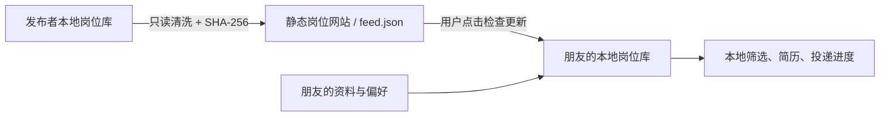

# 秋招助手

本机优先的「岗位作战台 + 求职素材库 + 按 JD 定制简历」。项目不附带作者的项目经历、实习、简历、联系方式、岗位备注或登录状态；第一次启动时，每位用户录入自己的事实与偏好。

支持 Windows 和 macOS，支持 Codex CLI 与 Claude Code CLI。许可证为 [0BSD](LICENSE)。

## 能做什么

- 用结构化访谈、旧简历导入、只读代码仓库分析三种方式建立个人素材库。
- 从公开 `feed.json`、本地 Excel、手动粘贴或可选采集器更新岗位。
- 由每位用户自己的岗位关键词、城市、届别、必须/排除关键词决定筛选和排序；没有行业预设。
- 为具体 JD 从“已确认素材”中选材，输出 PDF、Word 或两者，并保留投递进度。
- 将私人岗位数据库以只读方式清洗成公开岗位站点；发布协议中没有个人素材、分数、简历、备注或投递记录。



## 快速开始

要求 Node.js 20+，并至少安装、登录以下一个 CLI：

- [Codex CLI](https://developers.openai.com/codex/cli/)
- Claude Code CLI

Windows PowerShell：

```powershell
git clone https://github.com/lijiangdie-spec/autumn-recruitment-assistant.git
cd autumn-recruitment-assistant
powershell -ExecutionPolicy Bypass -File scripts/setup.ps1
npm run dev
```

macOS：

```bash
git clone https://github.com/lijiangdie-spec/autumn-recruitment-assistant.git
cd autumn-recruitment-assistant
bash scripts/setup.sh
npm run dev
```

打开 `http://127.0.0.1:3000`，按首次设置向导录入资料、岗位偏好和默认代理。PDF 输出需要 XeLaTeX、`pdfinfo`、`pdftotext`、`pdftoppm`；缺少这些工具时仍可使用 Word 输出和其余功能。

## 私人数据在哪里

默认数据目录：

- Windows：`%LOCALAPPDATA%\秋招助手`
- macOS：`~/Library/Application Support/秋招助手`
- Linux：`$XDG_DATA_HOME/autumn-recruitment-assistant`

可用 `AUTUMN_ASSISTANT_DATA_ROOT` 覆盖。程序默认拒绝把数据目录放进源码仓库。典型内容包括：

```text
profile.json              个人基本资料
preferences.json          岗位、简历与代理偏好
materials/                项目和实习事实
applications/             JD、简历和投递进度
recruitment.db            本地岗位数据库
imports/                  用户主动导入的文件
```

`.gitignore` 和 `npm run privacy:audit` 是第二道保护，但不能替代提交前人工复核。可通过 `PRIVACY_AUDIT_DENYLIST="姓名||邮箱||其他唯一字符串"` 加入自己的阻断词。

## 素材与简历

所有 AI 提取结果先保存为“草稿”；只有用户点击“确认事实”的素材可进入简历。代理进程只有指定目录的只读权限，结构化输出需通过 Zod/JSON Schema 校验。当前草稿渲染前后都会检查一页、可提取文本、占位符和预览图。

PDF 使用高密度单栏模板 C；Word 的 A/B 对应经典单栏和双栏。照片是可选项，放在私人数据目录的 `photo.jpg`，并在设置中显式启用。

## 岗位订阅

朋友只需在“岗位订阅”中填写静态站点的 `feed.json` URL，然后点击“保存并检查更新”。客户端会：

1. 校验 schema、`jobsHash` 和 `revision`；
2. 只导入岗位事实；
3. 用当前用户自己的偏好重新评分；
4. 将公开源中已撤下的订阅岗位标记为关闭；
5. 保留已有简历、备注和投递进度。

Feed 不一致时整批拒绝，不会以半更新状态覆盖本地岗位。内容变化时岗位使用稳定 ID 更新原记录，不会重复建档。

## 发布自己的岗位网站

先准备一个公开 GitHub 仓库并启用 GitHub Pages（Source 选择 GitHub Actions）。发布脚本直接以 SQLite `readonly` 模式读取岗位表，不初始化、不迁移私人数据库：

```powershell
$env:RECRUITMENT_DB_PATH = "D:\path\to\private\recruitment.db"
npm run feed:publish -- --out public-site/feed.json --commit --push
```

如需在私人系统每次更新岗位后自动发布，可在这个公开仓库另开一个终端运行默认关闭的外置桥：

```powershell
npm run feed:watch -- --db "D:\path\to\private\recruitment.db" --out public-site/feed.json --push
```

它只监听数据库及 WAL 文件的变更，2.5 秒防抖后重新清洗、提交并推送；推送失败会重试，生成的提交会留在本地供下一次继续推送。该桥不修改私人项目源码。

## 本地来源

本地 Excel 目录、工作表名和腾讯文档链接都通过设置或环境变量提供，仓库不内置作者的链接：

```bash
RECRUITMENT_IMPORT_DIRECTORY=/path/to/job-sheets
RECRUITMENT_IMPORT_SHEET_NAME=岗位信息
QQDOCS_DOCUMENT_URL=https://docs.qq.com/sheet/...?tab=...
QQDOCS_PROFILE_DIR=/path/outside/repository/qqdocs-profile
```

完整示例见 [.env.example](.env.example)。

## 开发与验证

```bash
npm run lint
npm run typecheck
npm test
npm run build
npm run privacy:audit
```

CI 会在 Windows 与 macOS 同时运行这些检查。静态岗位站点位于 `public-site/`，推送后由 Pages workflow 发布。

## 安全边界

- 这是个人求职工具，不用于替招聘方筛选或评价候选人。
- 代码仓库分析不会主动读取 `.env`、凭据、依赖目录或构建产物；仍请只授权你愿意分析的仓库。
- 公开 feed 只应包含你有权再发布的招聘信息，并应保留企业官方来源。
- 岗位状态与截止日期可能变化，投递前以企业官方页面为准。

欢迎提交 issue 和 pull request。请勿在 issue、截图、fixture 或日志中上传真实简历、电话号码、邮箱、登录 Cookie 或私人表格链接。
